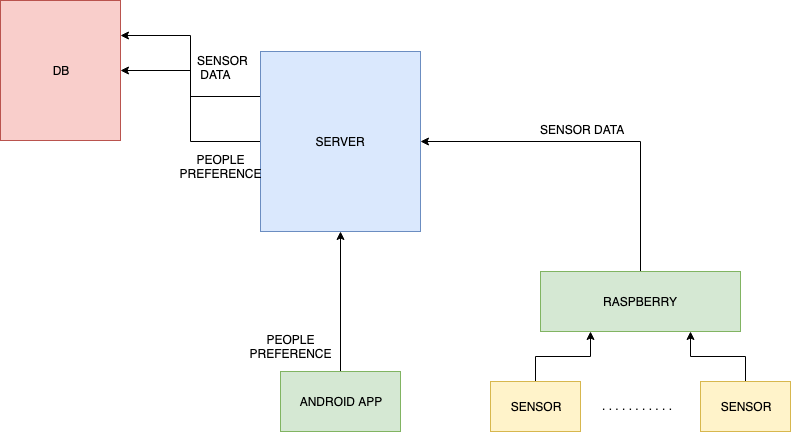
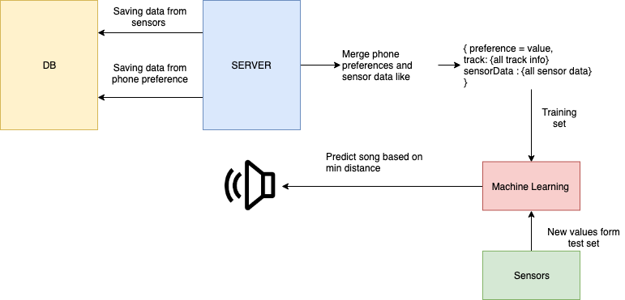

# IoT and Ambient Intelligence for realtime background music: experiments with gym athletes
Server part of my Master's degree thesis.
It's a machine learning project that suggests the right background music depends on the effort made by an athlete.

The server runs a SpringBoot application that receive data from user that give preference to a certain music track, from sensors and contain the machine learning logic.

